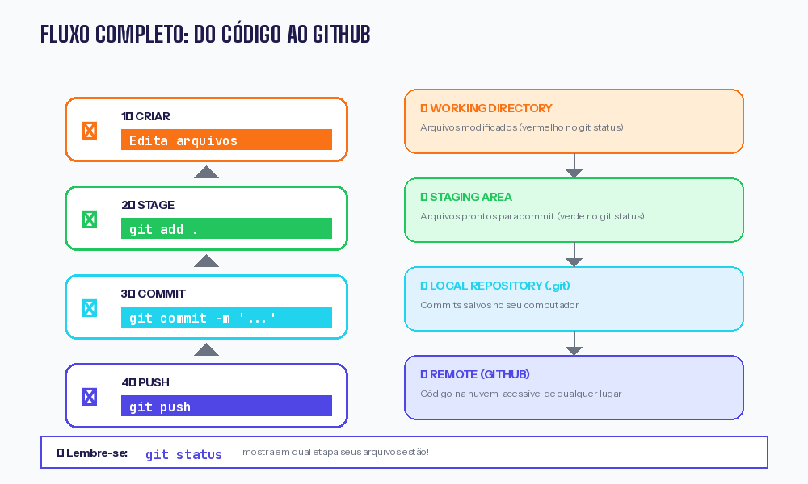
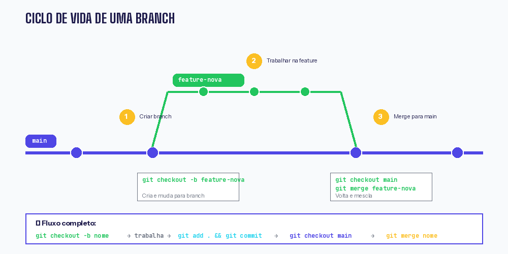
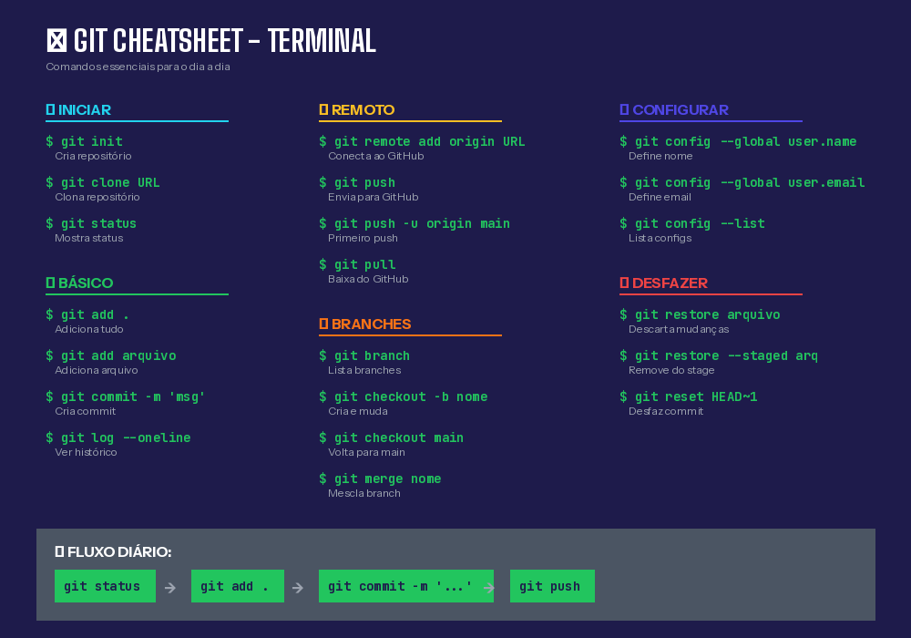

# Semana 02 — Git na Prática: Dominando o Terminal

!!! info "Informações da Aula"
    **Disciplina:** Sistemas Operacionais / Ferramentas WEB  
    **Data:** Fevereiro de 2026  
    **Tema:** Git e GitHub pelo Terminal (Linux e Windows)  
    **Pré-requisito:** Ter completado a Aula 01 (conta no GitHub criada)

---

## 🎯 Objetivo da Aula

Nesta aula você vai aprender a usar Git e GitHub **100% pelo terminal**, sem depender de interface gráfica. Isso é essencial porque:

- 🖥️ Servidores não têm interface gráfica
- ⚡ Terminal é mais rápido que clicar em botões
- 💼 Entrevistas técnicas pedem conhecimento de terminal
- 🛠️ Dá mais controle sobre o que você está fazendo

---

## 🖥️ Abrindo o Terminal

### No Linux (Ubuntu/Mint)

**Atalho:** `Ctrl + Alt + T`

Ou: Menu → Terminal

### No Windows

**Opção 1 — Git Bash (Recomendado)**

Após instalar o Git, procure por "Git Bash" no menu iniciar.

**Opção 2 — PowerShell**

Clique direito no menu iniciar → "Terminal" ou "PowerShell"

**Opção 3 — CMD**

Pressione `Win + R`, digite `cmd`, pressione Enter.

!!! tip "Recomendação para Windows"
    Use o **Git Bash**! Ele simula um terminal Linux e os comandos são idênticos aos do Linux.

---

## ⚙️ Configuração Inicial (Primeira vez apenas)

Antes de usar o Git, você precisa se identificar. Execute estes comandos:

```bash
# Configurar seu nome (aparece nos commits)
git config --global user.name "Seu Nome Completo"

# Configurar seu email (MESMO do GitHub!)
git config --global user.email "seu.email@exemplo.com"

# Definir branch padrão como 'main'
git config --global init.defaultBranch main

# Configurar editor padrão (opcional)
git config --global core.editor "nano"
```

### Verificar se configurou certo

```bash
git config --list
```

Deve mostrar:

```
user.name=Seu Nome Completo
user.email=seu.email@exemplo.com
init.defaultbranch=main
```

---

## 📁 Projeto Prático: Criando um Portfólio

Vamos criar um projeto real do zero! Um portfólio pessoal simples.

### Passo 1 — Criar a pasta do projeto

```bash
# Ir para a pasta home
cd ~

# Criar pasta do projeto
mkdir meu-portfolio

# Entrar na pasta
cd meu-portfolio

# Verificar onde você está
pwd
```

**Saída esperada:**

```
/home/seu-usuario/meu-portfolio
```

---

### Passo 2 — Inicializar o Git

```bash
git init
```

**Saída esperada:**

```
Initialized empty Git repository in /home/seu-usuario/meu-portfolio/.git/
```

!!! note "O que aconteceu?"
    O Git criou uma pasta oculta chamada `.git` dentro do seu projeto. É lá que ele guarda todo o histórico.

Para ver a pasta oculta:

```bash
ls -la
```

---

### Passo 3 — Criar o primeiro arquivo

Vamos criar um README.md (arquivo de apresentação do projeto):

```bash
# Criar arquivo com echo
echo "# Meu Portfólio" > README.md
echo "" >> README.md
echo "Olá! Sou estudante de Engenharia de Software." >> README.md
echo "" >> README.md
echo "## Sobre mim" >> README.md
echo "- 🎓 Cursando Engenharia de Software" >> README.md
echo "- 💻 Aprendendo Git e GitHub" >> README.md
echo "- 🌱 Em constante evolução" >> README.md
```

**Verificar o conteúdo:**

```bash
cat README.md
```

**Saída esperada:**

```markdown
# Meu Portfólio

Olá! Sou estudante de Engenharia de Software.

## Sobre mim
- 🎓 Cursando Engenharia de Software
- 💻 Aprendendo Git e GitHub
- 🌱 Em constante evolução
```

---

### Passo 4 — Verificar o status

```bash
git status
```

**Saída esperada:**

```
On branch main

No commits yet

Untracked files:
  (use "git add <file>..." to include in what will be committed)
        README.md

nothing added to commit but untracked files present
```

!!! info "Traduzindo"
    - **Untracked files** = Arquivos que o Git ainda não está monitorando
    - O Git está te dizendo: "Ei, tem um arquivo novo aqui, quer que eu cuide dele?"

---

### Passo 5 — Adicionar ao Stage (git add)

```bash
# Adicionar um arquivo específico
git add README.md

# OU adicionar todos os arquivos de uma vez
git add .
```

**Verificar novamente:**

```bash
git status
```

**Saída esperada:**

```
On branch main

No commits yet

Changes to be committed:
  (use "git rm --cached <file>..." to unstage)
        new file:   README.md
```

!!! success "Mudou de cor!"
    Agora o arquivo está em **verde** (Changes to be committed). Isso significa que está pronto para o commit.

---

### Passo 6 — Fazer o Commit

```bash
git commit -m "Cria README com informações iniciais"
```

**Saída esperada:**

```
[main (root-commit) abc1234] Cria README com informações iniciais
 1 file changed, 8 insertions(+)
 create mode 100644 README.md
```



!!! tip "Boas práticas para mensagens de commit"
    - ✅ `"Adiciona página de contato"`
    - ✅ `"Corrige erro no formulário de login"`
    - ✅ `"Atualiza estilo do botão principal"`
    - ❌ `"Alterações"`
    - ❌ `"asdfgh"`
    - ❌ `"commit"`

---

### Passo 7 — Ver o histórico

```bash
git log
```

**Saída esperada:**

```
commit abc1234def5678... (HEAD -> main)
Author: Seu Nome <seu.email@exemplo.com>
Date:   Mon Feb 17 10:30:00 2026 -0300

    Cria README com informações iniciais
```

**Versão resumida:**

```bash
git log --oneline
```

**Saída:**

```
abc1234 Cria README com informações iniciais
```

---

## 🌐 Conectando ao GitHub

Agora vamos enviar seu projeto para o GitHub!

### Passo 1 — Criar repositório no GitHub

1. Acesse [github.com](https://github.com)
2. Clique no **"+"** → **"New repository"**
3. Preencha:
    - **Repository name:** `meu-portfolio`
    - **Description:** `Meu portfólio pessoal`
    - **Public** ✓
    - **NÃO marque** "Add a README file" (já temos!)
4. Clique **"Create repository"**

### Passo 2 — Copiar o link do repositório

O GitHub vai mostrar instruções. Copie o link HTTPS:

```
https://github.com/SEU_USUARIO/meu-portfolio.git
```

### Passo 3 — Conectar repositório local ao GitHub

```bash
git remote add origin https://github.com/SEU_USUARIO/meu-portfolio.git
```

**Verificar se conectou:**

```bash
git remote -v
```

**Saída esperada:**

```
origin  https://github.com/SEU_USUARIO/meu-portfolio.git (fetch)
origin  https://github.com/SEU_USUARIO/meu-portfolio.git (push)
```

### Passo 4 — Enviar para o GitHub (Push)

```bash
git push -u origin main
```

**O terminal vai pedir:**

```
Username for 'https://github.com': seu_usuario
Password for 'https://github.com': (cole seu token aqui)
```

!!! warning "ATENÇÃO: Não é sua senha!"
    O GitHub não aceita mais senha comum. Você precisa usar um **Personal Access Token**.

### Passo 5 — Criar o Token (se ainda não tiver)

1. No GitHub: Foto de perfil → **Settings**
2. Menu lateral → **Developer settings**
3. **Personal access tokens** → **Tokens (classic)**
4. **Generate new token** → **Generate new token (classic)**
5. Preencha:
    - **Note:** `terminal`
    - **Expiration:** 90 days
    - **Marque:** ☑️ `repo`
6. **Generate token**
7. **COPIE O TOKEN** (começa com `ghp_...`)

!!! danger "Copie agora!"
    O token só aparece uma vez. Se perder, terá que criar outro.

### Passo 6 — Colar o token

Quando pedir "Password", cole o token e pressione Enter.

**Não vai aparecer nada na tela** (é por segurança). Só cole e aperte Enter.

**Saída de sucesso:**

```
Enumerating objects: 3, done.
Counting objects: 100% (3/3), done.
Writing objects: 100% (3/3), 312 bytes | 312.00 KiB/s, done.
Total 3 (delta 0), reused 0 (delta 0)
To https://github.com/SEU_USUARIO/meu-portfolio.git
 * [new branch]      main -> main
Branch 'main' set up to track remote branch 'main' from 'origin'.
```

### 🎉 Verifique no GitHub!

Acesse: `https://github.com/SEU_USUARIO/meu-portfolio`

Seu código está lá!

---

## 📝 Fazendo Alterações e Novos Commits

Vamos adicionar mais conteúdo ao projeto.

### Criar arquivo de projetos

```bash
# Criar arquivo
echo "# Meus Projetos" > projetos.md
echo "" >> projetos.md
echo "## 1. Newsletter Engenharia de Software" >> projetos.md
echo "Site com resumos semanais das aulas." >> projetos.md
echo "" >> projetos.md
echo "## 2. Meu Portfólio" >> projetos.md
echo "Este repositório!" >> projetos.md
```

### Verificar status

```bash
git status
```

**Saída:**

```
On branch main
Untracked files:
        projetos.md
```

### Adicionar e commitar

```bash
git add projetos.md
git commit -m "Adiciona lista de projetos"
```

### Enviar para o GitHub

```bash
git push
```

Pronto! Não precisa mais do `-u origin main`, só `git push`.

---

## 🌿 Trabalhando com Branches

Branches permitem trabalhar em funcionalidades sem afetar o código principal.



### Criar uma branch

```bash
# Criar e mudar para nova branch
git checkout -b pagina-contato
```

**Saída:**

```
Switched to a new branch 'pagina-contato'
```

### Ver branches existentes

```bash
git branch
```

**Saída:**

```
  main
* pagina-contato
```

O `*` indica em qual branch você está.

### Fazer alterações na branch

```bash
# Criar arquivo de contato
echo "# Contato" > contato.md
echo "" >> contato.md
echo "- Email: seu.email@exemplo.com" >> contato.md
echo "- GitHub: github.com/seu_usuario" >> contato.md
echo "- LinkedIn: linkedin.com/in/seu_usuario" >> contato.md

# Adicionar e commitar
git add contato.md
git commit -m "Adiciona página de contato"
```

### Voltar para main

```bash
git checkout main
```

**Verifique:**

```bash
ls
```

O arquivo `contato.md` sumiu! Ele só existe na branch `pagina-contato`.

### Mesclar (Merge) a branch

```bash
# Estando na main, trazer as mudanças da outra branch
git merge pagina-contato
```

**Saída:**

```
Updating abc1234..def5678
Fast-forward
 contato.md | 5 +++++
 1 file changed, 5 insertions(+)
 create mode 100644 contato.md
```

Agora o `contato.md` está na main!

### Deletar a branch (opcional)

```bash
git branch -d pagina-contato
```

### Enviar tudo para o GitHub

```bash
git push
```

---

## 📥 Baixando Atualizações (Pull)

Se você ou outra pessoa fez alterações pelo GitHub, baixe assim:

```bash
git pull
```

Isso baixa e mescla automaticamente.

---

## 🔁 Resumo: Fluxo de Trabalho Diário

```bash
# 1. Verificar status
git status

# 2. Adicionar arquivos modificados
git add .

# 3. Criar commit
git commit -m "Descrição clara do que foi feito"

# 4. Enviar para o GitHub
git push
```

---

## 📋 Comandos Completos



### Configuração

| Comando | Descrição |
|---------|-----------|
| `git config --global user.name "Nome"` | Define seu nome |
| `git config --global user.email "email"` | Define seu email |
| `git config --list` | Lista configurações |

### Básico

| Comando | Descrição |
|---------|-----------|
| `git init` | Inicia repositório |
| `git status` | Mostra status dos arquivos |
| `git add arquivo` | Adiciona arquivo ao stage |
| `git add .` | Adiciona todos os arquivos |
| `git commit -m "msg"` | Cria commit |
| `git log` | Mostra histórico |
| `git log --oneline` | Histórico resumido |

### Remoto (GitHub)

| Comando | Descrição |
|---------|-----------|
| `git remote add origin URL` | Conecta ao GitHub |
| `git remote -v` | Lista conexões |
| `git push` | Envia para GitHub |
| `git push -u origin main` | Primeiro push |
| `git pull` | Baixa do GitHub |
| `git clone URL` | Clona repositório |

### Branches

| Comando | Descrição |
|---------|-----------|
| `git branch` | Lista branches |
| `git branch nome` | Cria branch |
| `git checkout nome` | Muda de branch |
| `git checkout -b nome` | Cria e muda |
| `git merge nome` | Mescla branch |
| `git branch -d nome` | Deleta branch |

---

## 🎬 Vídeos Recomendados

| Vídeo | Canal | Link |
|-------|-------|------|
| Git pelo Terminal | Curso em Vídeo | [YouTube](https://www.youtube.com/watch?v=2sLB1Mv3_-k) |
| Terminal Linux para Devs | Diolinux | [YouTube](https://www.youtube.com/watch?v=Vw6P5SvFT-c) |
| Git na Prática | Código Fonte TV | [YouTube](https://www.youtube.com/watch?v=UBAX-13g8OM) |

---

## 🛠️ Exercício Prático

**Faça sozinho:**

1. Crie uma pasta `exercicio-git`
2. Inicialize o Git
3. Crie um arquivo `ola.txt` com seu nome
4. Faça commit
5. Crie uma branch `feature-idade`
6. Adicione sua idade ao arquivo
7. Faça commit na branch
8. Volte para main
9. Faça merge
10. Crie repositório no GitHub e envie

**Comandos que você vai usar:**

```bash
mkdir exercicio-git
cd exercicio-git
git init
echo "Meu nome é ..." > ola.txt
git add .
git commit -m "Primeiro commit"
git checkout -b feature-idade
echo "Tenho XX anos" >> ola.txt
git add .
git commit -m "Adiciona idade"
git checkout main
git merge feature-idade
git remote add origin https://github.com/SEU_USUARIO/exercicio-git.git
git push -u origin main
```

---

## ✅ Checklist da Aula

- [ ] Sei abrir o terminal no meu sistema
- [ ] Configurei nome e email no Git
- [ ] Criei um repositório do zero com `git init`
- [ ] Fiz commits pelo terminal
- [ ] Conectei ao GitHub com `git remote`
- [ ] Enviei código com `git push`
- [ ] Criei e mesclei branches
- [ ] Entendo o fluxo: add → commit → push

---

## 🆘 Problemas Comuns

### "fatal: not a git repository"

Você não está numa pasta com Git. Execute `git init` ou entre na pasta certa.

### "error: failed to push some refs"

O GitHub tem commits que você não tem. Execute:

```bash
git pull --rebase
git push
```

### "Authentication failed"

Token errado ou expirado. Crie um novo token.

### "Permission denied"

No Linux, pode ser problema de permissão:

```bash
sudo chown -R $USER:$USER .git
```

---

## 🔜 Próxima Aula

Na **Semana 03** vamos ver:

- Como resolver conflitos de merge
- Git diff: vendo diferenças
- .gitignore: ignorando arquivos
- Git stash: guardando alterações temporárias

---

!!! question "Dúvidas?"
    Pratique os comandos! A melhor forma de aprender é fazendo. Se travar, me chama no grupo!
