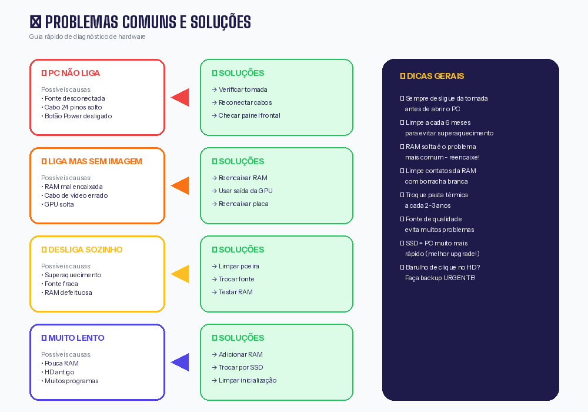

# Aula — Arquitetura de Hardware: Conhecendo o Computador por Dentro

!!! info "Informações da Aula"
    **Disciplina:** Sistemas Operacionais  
    **Data:** Fevereiro de 2026  
    **Tipo:** Aula Prática  
    **Professor:** Time Robótica  
    **Tema:** Desmontagem, identificação de componentes e remontagem de CPU


---

## 🎯 Objetivo da Aula

Nesta aula prática, você aprendeu a:

- ✅ Identificar os principais componentes de um computador
- ✅ Entender a função de cada peça
- ✅ Desmontar e remontar um PC com segurança
- ✅ Conectar corretamente os cabos para gerar vídeo
- ✅ Compreender o papel do Kernel no sistema

---

## 🖥️ Anatomia de um Computador

Antes de colocar a mão na massa, vamos entender o que tem dentro de um computador:


### Visão Geral

Um computador é composto por **hardware** (parte física) e **software** (programas). Nesta aula, focamos no hardware.

```
┌─────────────────────────────────────────────────────────┐
│                      GABINETE                           │
│  ┌─────────────────────────────────────────────────┐   │
│  │              PLACA-MÃE (Motherboard)            │   │
│  │  ┌─────┐  ┌─────┐  ┌─────────────────────┐     │   │
│  │  │ CPU │  │ RAM │  │   Slots de Expansão │     │   │
│  │  └─────┘  └─────┘  └─────────────────────┘     │   │
│  │  ┌─────────────┐  ┌─────────────────────┐      │   │
│  │  │ Chipset     │  │   Conectores SATA   │      │   │
│  │  └─────────────┘  └─────────────────────┘      │   │
│  └─────────────────────────────────────────────────┘   │
│  ┌─────────┐  ┌─────────┐  ┌─────────────────────┐    │
│  │  Fonte  │  │   HD    │  │   Placa de Vídeo    │    │
│  └─────────┘  └─────────┘  └─────────────────────┘    │
└─────────────────────────────────────────────────────────┘
```

---

## 🧩 Componentes Principais

### 1. 🧠 Processador (CPU)

**O que é:** O "cérebro" do computador. Executa todas as instruções e cálculos.

**Onde fica:** Encaixado no socket da placa-mãe, coberto pelo cooler.

**Como identificar:** Chip quadrado com muitos pinos embaixo (ou contatos dourados).

| Característica | Descrição |
|----------------|-----------|
| **Função** | Processar instruções e fazer cálculos |
| **Marcas comuns** | Intel (Core i3, i5, i7, i9) e AMD (Ryzen) |
| **Medida de velocidade** | GHz (Gigahertz) |
| **Núcleos** | Quanto mais, melhor para multitarefas |

!!! warning "Cuidado!"
    - Nunca toque nos pinos/contatos do processador
    - O processador esquenta MUITO — sempre precisa de cooler
    - A pasta térmica é essencial para dissipar o calor

```
        ┌───────────────┐
        │   ▓▓▓▓▓▓▓▓▓   │  ← Cooler (ventilador)
        │   ▓▓▓▓▓▓▓▓▓   │
        ├───────────────┤
        │  ┌─────────┐  │  ← Processador (CPU)
        │  │  ● ● ●  │  │
        │  │  ● ● ●  │  │
        │  └─────────┘  │
        └───────────────┘
              ↓
        Socket na placa-mãe
```

---

### 2. 🎛️ Placa-Mãe (Motherboard)

**O que é:** A "espinha dorsal" do computador. Conecta todos os componentes.

**Onde fica:** Presa ao gabinete com parafusos.

**Como identificar:** Maior placa verde/preta dentro do gabinete.

| Componente na placa | Função |
|---------------------|--------|
| **Socket** | Encaixe do processador |
| **Slots de RAM** | Encaixe das memórias |
| **Slots PCIe** | Placa de vídeo e outras placas |
| **Conectores SATA** | Ligar HD/SSD |
| **Conectores de energia** | Receber energia da fonte |
| **Portas traseiras** | USB, HDMI, VGA, Ethernet, áudio |
| **Chipset** | Controla a comunicação entre componentes |
| **BIOS/UEFI** | Firmware que inicia o computador |

```
┌─────────────────────────────────────────────────────┐
│  [USB] [USB] [HDMI] [VGA] [LAN] [AUDIO]            │ ← Painel traseiro
├─────────────────────────────────────────────────────┤
│    ┌──────┐                                         │
│    │SOCKET│ ← CPU vai aqui      ┌────┐ ┌────┐      │
│    └──────┘                     │RAM │ │RAM │      │
│                                 └────┘ └────┘      │
│  ┌─────────────────────────────────────────────┐   │
│  │           PCIe x16 (Placa de vídeo)         │   │
│  └─────────────────────────────────────────────┘   │
│  ┌─────────────────────────────────────────────┐   │
│  │           PCIe x1                           │   │
│  └─────────────────────────────────────────────┘   │
│                                 ┌────┐ ┌────┐      │
│     [SATA] [SATA] [SATA]       │BIOS│ │CHIP│      │
│                                 └────┘ └────┘      │
│  ┌──────────────────────┐                          │
│  │ Conector Energia 24p │    [Painel Frontal]     │
│  └──────────────────────┘                          │
└─────────────────────────────────────────────────────┘
```

---

### 3. 💾 Memória RAM

**O que é:** Memória temporária (volátil). Guarda dados enquanto o PC está ligado.

**Onde fica:** Slots alongados próximos ao processador.

**Como identificar:** Pentes retangulares finos.

| Característica | Descrição |
|----------------|-----------|
| **Função** | Armazenar dados em uso no momento |
| **Volátil** | Perde tudo quando desliga |
| **Capacidade comum** | 4GB, 8GB, 16GB, 32GB |
| **Tipos** | DDR3, DDR4, DDR5 (não são compatíveis entre si!) |

!!! tip "Analogia"
    - **RAM** = Mesa de trabalho (espaço para trabalhar agora)
    - **HD/SSD** = Armário (guarda arquivos permanentemente)
    
    Quanto maior a mesa (RAM), mais coisas você pode fazer ao mesmo tempo!

**Como encaixar:**

```
                    ↓ Trava (aberta)
    ┌─────────────────────────────────────┐
    │  │ │ │ │ │ │ │ │ │ │ │ │ │ │ │ │ │  │
    │  ▼ ▼ ▼ ▼ ▼ ▼ ▼ ▼ ▼ ▼ ▼ ▼ ▼ ▼ ▼ ▼ ▼  │  ← Pente de RAM
    │          ┌─────┐                     │
    └──────────│     │─────────────────────┘
               └─────┘
                  ↑ Encaixe (tem uma divisória que impede encaixar errado)
```

---

### 4. 💿 Armazenamento (HD e SSD)

**O que é:** Onde ficam guardados seus arquivos, sistema operacional e programas.

**Tipos:**

| Tipo | Tecnologia | Velocidade | Durabilidade |
|------|------------|------------|--------------|
| **HD (Hard Disk)** | Disco magnético giratório | Lento | Frágil (tem peças móveis) |
| **SSD (Solid State)** | Memória flash (chips) | Muito rápido | Resistente |
| **NVMe** | SSD conectado direto na placa-mãe | Ultra rápido | Resistente |

!!! success "Dica de upgrade"
    Trocar o HD por um SSD é a melhor melhoria custo-benefício! O PC fica MUITO mais rápido.

```
HD (Hard Disk)              SSD (Solid State)
┌─────────────────┐         ┌─────────────────┐
│  ┌───────────┐  │         │                 │
│  │  ○     ○  │  │         │  ▓▓▓▓▓▓▓▓▓▓▓▓  │
│  │     ◎     │  │         │  ▓▓ CHIPS ▓▓▓  │
│  │  ○     ○  │  │         │  ▓▓▓▓▓▓▓▓▓▓▓▓  │
│  └───────────┘  │         │                 │
│    ↑ Disco      │         │  Sem partes     │
│    giratório    │         │  móveis!        │
└─────────────────┘         └─────────────────┘
```

---

### 5. ⚡ Fonte de Alimentação (PSU)

**O que é:** Converte a energia da tomada (AC) para energia que o PC usa (DC).

**Onde fica:** Geralmente na parte superior ou inferior traseira do gabinete.

**Como identificar:** Caixa de metal com ventilador e muitos cabos coloridos.

| Conector | Função |
|----------|--------|
| **24 pinos** | Energia principal da placa-mãe |
| **4/8 pinos** | Energia do processador |
| **6/8 pinos PCIe** | Energia da placa de vídeo |
| **SATA** | Energia para HD/SSD |
| **Molex** | Energia para ventoinhas e acessórios |

!!! warning "Segurança"
    - SEMPRE desligue da tomada antes de mexer na fonte
    - Nunca abra a fonte — ela armazena energia mesmo desligada
    - Use fonte de qualidade — fonte ruim pode queimar o PC inteiro

---

### 6. 🎮 Placa de Vídeo (GPU)

**O que é:** Processa gráficos e imagens. Essencial para jogos e edição de vídeo.

**Onde fica:** Slot PCIe x16 da placa-mãe (o maior slot).

**Como identificar:** Placa grande com ventiladores, saídas de vídeo (HDMI, DisplayPort).

| Tipo | Descrição |
|------|-----------|
| **Integrada** | Embutida no processador. Básica. |
| **Dedicada** | Placa separada. Muito mais potente. |

**Marcas:** NVIDIA (GeForce) e AMD (Radeon)

!!! note "Vídeo integrado vs dedicado"
    - **Integrado:** Suficiente para uso básico, Office, vídeos
    - **Dedicado:** Necessário para jogos, 3D, edição de vídeo

---

### 7. 🌀 Sistema de Refrigeração

**O que é:** Mantém os componentes em temperatura segura.

**Tipos:**

| Tipo | Descrição |
|------|-----------|
| **Cooler de CPU** | Ventilador + dissipador sobre o processador |
| **Fans do gabinete** | Ventoinhas que circulam ar |
| **Water Cooler** | Sistema de refrigeração a água (avançado) |

**Pasta térmica:** Gel que melhora a transferência de calor entre CPU e cooler. Precisa trocar a cada 2-3 anos.

---

## 🔧 Problemas Comuns e Soluções



### ❌ PC não liga

| Possível causa | Solução |
|----------------|---------|
| Fonte não conectada na tomada | Verificar tomada e chave da fonte (I/O) |
| Cabo de energia da placa-mãe solto | Reconectar o cabo de 24 pinos |
| Botão Power desconectado | Verificar fios do painel frontal |
| Fonte queimada | Testar com outra fonte |
| RAM mal encaixada | Remover e recolocar a RAM |

**Teste básico:** Se ao ligar as ventoinhas giram, a fonte está ok.

---

### ❌ PC liga mas não exibe imagem

| Possível causa | Solução |
|----------------|---------|
| Monitor no cabo errado | Conectar na placa de vídeo (não na placa-mãe) |
| RAM mal encaixada | Tirar e recolocar a RAM com firmeza |
| Placa de vídeo mal encaixada | Reencaixar a placa de vídeo |
| Cabo de vídeo com defeito | Testar outro cabo HDMI/VGA |
| Monitor desligado/entrada errada | Verificar botão e input do monitor |

!!! tip "Dica de ouro"
    Quando não aparecer vídeo, **tire a RAM, limpe os contatos** com borracha branca e recoloque. Resolve 70% dos casos!

---

### ❌ PC desliga sozinho / reinicia

| Possível causa | Solução |
|----------------|---------|
| Superaquecimento | Limpar poeira, trocar pasta térmica |
| Fonte fraca/defeituosa | Trocar a fonte |
| RAM com defeito | Testar um pente de cada vez |
| Sistema operacional corrompido | Reinstalar o SO |

---

### ❌ PC muito lento

| Possível causa | Solução |
|----------------|---------|
| Pouca RAM | Adicionar mais memória RAM |
| HD antigo | Trocar HD por SSD |
| Muitos programas iniciando | Desativar programas na inicialização |
| Vírus/malware | Verificar com antivírus |
| Superaquecimento | Limpar e melhorar ventilação |

---

### ❌ Barulhos estranhos

| Barulho | Causa provável | Solução |
|---------|----------------|---------|
| Click click | HD com defeito | Fazer backup URGENTE e trocar HD |
| Zumbido alto | Ventoinha suja/com defeito | Limpar ou trocar ventoinha |
| Chiado | Fonte com problema | Trocar fonte |
| Vibração | Parafuso solto ou ventoinha desbalanceada | Apertar parafusos |

---

## 🧹 Limpeza e Conservação

### Por que limpar?

- Poeira acumulada = superaquecimento
- Superaquecimento = lentidão e travamentos
- Casos extremos = componentes queimados

### Com que frequência?

| Ambiente | Frequência |
|----------|------------|
| Casa limpa, sem pets | A cada 6-12 meses |
| Casa com pets/poeira | A cada 3-6 meses |
| Ambiente industrial | Mensal |

### Como limpar

**Materiais necessários:**

- ✅ Pano de microfibra
- ✅ Pincel antiestático (ou pincel de maquiagem limpo)
- ✅ Ar comprimido (lata ou compressor)
- ✅ Álcool isopropílico (70% ou mais)
- ✅ Borracha branca (para contatos da RAM)

**Passo a passo:**

```
1. DESLIGUE o PC e tire da tomada
2. Aguarde 5 minutos (capacitores descarregarem)
3. Abra o gabinete (geralmente parafusos atrás)
4. Use ar comprimido para soprar a poeira
   - Segure as ventoinhas para não girarem!
5. Use o pincel para poeira mais grudada
6. Limpe os contatos da RAM com borracha branca
7. Se for trocar pasta térmica:
   - Limpe a antiga com álcool isopropílico
   - Aplique quantidade do tamanho de um grão de arroz
8. Feche o gabinete
```

!!! danger "NUNCA faça isso!"
    - ❌ Usar aspirador de pó (gera estática)
    - ❌ Usar pano molhado com água
    - ❌ Soprar com a boca (umidade!)
    - ❌ Limpar com o PC ligado

---

## 🧠 O Kernel: O Coração do Sistema Operacional

### O que é o Kernel?

O **Kernel** é o núcleo do sistema operacional. Ele é o intermediário entre o **hardware** (peças físicas) e o **software** (programas).


```
┌─────────────────────────────────────────────────────┐
│                    APLICATIVOS                       │
│         (Navegador, Word, Jogos, etc.)              │
├─────────────────────────────────────────────────────┤
│                SISTEMA OPERACIONAL                   │
│    ┌─────────────────────────────────────────┐      │
│    │              K E R N E L                 │      │
│    │   (Gerencia tudo que acontece embaixo)  │      │
│    └─────────────────────────────────────────┘      │
├─────────────────────────────────────────────────────┤
│                     HARDWARE                         │
│        (CPU, RAM, HD, Placa de Vídeo, etc.)         │
└─────────────────────────────────────────────────────┘
```

### Funções do Kernel

| Função | Descrição |
|--------|-----------|
| **Gerenciar processos** | Decide qual programa usa a CPU e quando |
| **Gerenciar memória** | Distribui RAM entre os programas |
| **Gerenciar dispositivos** | Comunica com hardware (drivers) |
| **Gerenciar arquivos** | Organiza dados no HD/SSD |
| **Segurança** | Impede que programas acessem áreas proibidas |

### Analogia: O Kernel é como um gerente de hotel

```
🏨 HOTEL = COMPUTADOR

👔 Gerente (Kernel):
   - Distribui quartos (memória) para hóspedes (programas)
   - Organiza quem usa o elevador (CPU) e quando
   - Cuida da segurança (não deixa hóspede entrar no quarto errado)
   - Controla os funcionários (drivers de hardware)

🧳 Hóspedes (Aplicativos):
   - Querem usar recursos do hotel
   - Precisam pedir ao gerente
   - Não podem fazer o que quiserem

🔧 Funcionários (Drivers):
   - Fazem o trabalho pesado
   - Recebem ordens do gerente
```

### Tipos de Kernel

| Tipo | Descrição | Exemplo |
|------|-----------|---------|
| **Monolítico** | Tudo junto no kernel (mais rápido) | Linux |
| **Microkernel** | Mínimo no kernel, resto fora (mais seguro) | MINIX |
| **Híbrido** | Mistura dos dois | Windows, macOS |

### Kernel no Linux

No Linux, o kernel é literalmente chamado **Linux** (criado por Linus Torvalds em 1991).

```bash
# Ver versão do kernel no Linux
uname -r

# Saída exemplo:
5.15.0-92-generic
```

O "Linux" que usamos (Ubuntu, Mint) é na verdade:

```
Ubuntu = Kernel Linux + Programas GNU + Interface Gráfica + Aplicativos
```

Por isso muitos chamam de **GNU/Linux**.

---

## 🔌 Conexões: Montando o PC

### Ordem recomendada de montagem

```
1. Instalar CPU na placa-mãe
2. Instalar cooler da CPU (com pasta térmica)
3. Instalar memória RAM
4. Instalar placa-mãe no gabinete
5. Conectar fonte de alimentação
6. Instalar HD/SSD
7. Instalar placa de vídeo
8. Conectar cabos do painel frontal
9. Conectar cabos de energia
10. Conectar cabos de dados (SATA)
11. Fechar e testar
```

### Cabos essenciais

| Cabo | De → Para | Obrigatório? |
|------|-----------|--------------|
| 24 pinos | Fonte → Placa-mãe | ✅ Sim |
| 4/8 pinos CPU | Fonte → Placa-mãe (perto da CPU) | ✅ Sim |
| SATA dados | HD/SSD → Placa-mãe | ✅ Sim |
| SATA energia | Fonte → HD/SSD | ✅ Sim |
| 6/8 pinos PCIe | Fonte → Placa de vídeo | Se tiver placa dedicada |
| Painel frontal | Gabinete → Placa-mãe | ✅ Para botão ligar |
| HDMI/VGA | Placa de vídeo → Monitor | ✅ Sim |

---

## 📋 Checklist de Montagem

Antes de ligar, verifique:

- [ ] CPU encaixada corretamente (seta alinhada)
- [ ] Cooler bem preso e com pasta térmica
- [ ] RAM encaixada até ouvir "click"
- [ ] Cabo 24 pinos conectado na placa-mãe
- [ ] Cabo 4/8 pinos da CPU conectado
- [ ] HD/SSD com cabo de dados E energia
- [ ] Placa de vídeo bem encaixada no slot
- [ ] Cabos do painel frontal conectados
- [ ] Nenhum parafuso solto dentro do gabinete
- [ ] Chave da fonte na posição "I" (ligado)

---

## 🎬 Vídeos Recomendados

| Vídeo | Canal | Descrição |
|-------|-------|-----------|
| [Como montar um PC](https://www.youtube.com/watch?v=hK51upU5bkU) | Adrenaline | Tutorial completo de montagem |
| [Entenda cada peça do PC](https://www.youtube.com/watch?v=ExxFxD4OSZ0) | Diolinux | Explicação de componentes |
| [O que é o Kernel](https://www.youtube.com/watch?v=7OLwpBjeebc) | Fabio Akita | Explicação técnica acessível |
| [Limpeza de PC](https://www.youtube.com/watch?v=Y51yZE18qus) | Peperaio Hardware | Tutorial de limpeza |

---

## ✅ Checklist da Aula

- [ ] Sei identificar os principais componentes de um PC
- [ ] Entendo a função de cada componente
- [ ] Sei desmontar e remontar um computador básico
- [ ] Conheço problemas comuns e suas soluções
- [ ] Sei como fazer limpeza básica
- [ ] Entendo o que é o Kernel e sua função

---

## 📝 Glossário

| Termo | Significado |
|-------|-------------|
| **CPU** | Central Processing Unit (processador) |
| **GPU** | Graphics Processing Unit (processador gráfico) |
| **RAM** | Random Access Memory (memória volátil) |
| **HD** | Hard Disk (disco rígido) |
| **SSD** | Solid State Drive (disco de estado sólido) |
| **PSU** | Power Supply Unit (fonte de alimentação) |
| **BIOS** | Basic Input/Output System (firmware básico) |
| **UEFI** | Unified Extensible Firmware Interface (BIOS moderno) |
| **Socket** | Encaixe do processador na placa-mãe |
| **Chipset** | Conjunto de chips que controla comunicação |
| **Driver** | Programa que permite o SO comunicar com hardware |
| **Kernel** | Núcleo do sistema operacional |

---

!!! question "Dúvidas?"
    Hardware parece complicado no início, mas com prática fica natural! Qualquer dúvida, chama no grupo! 🔧
