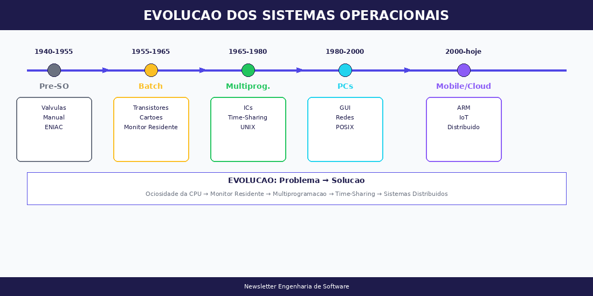
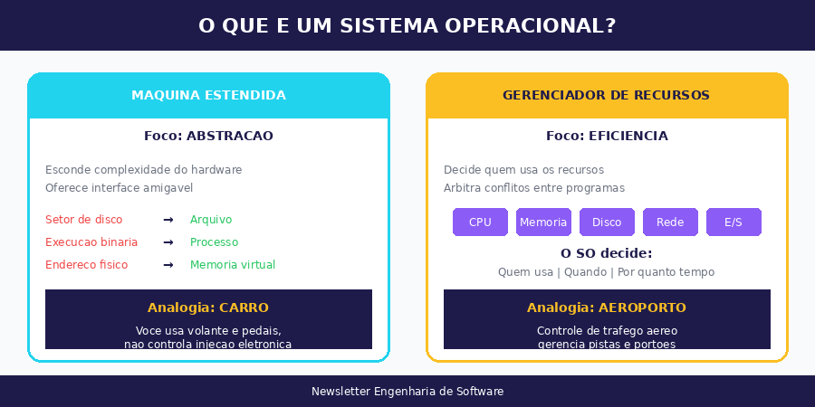
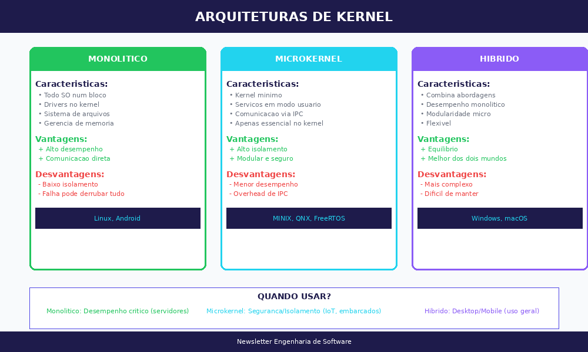
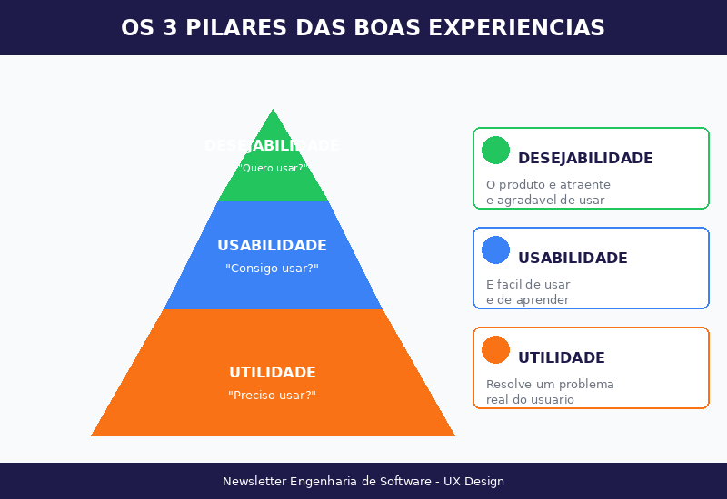
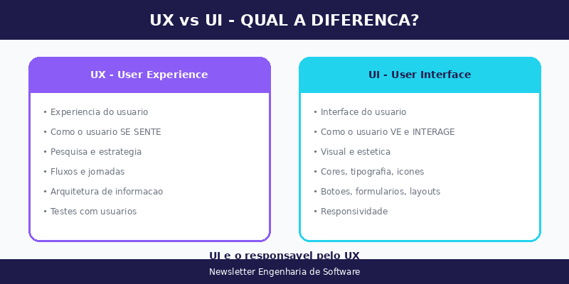
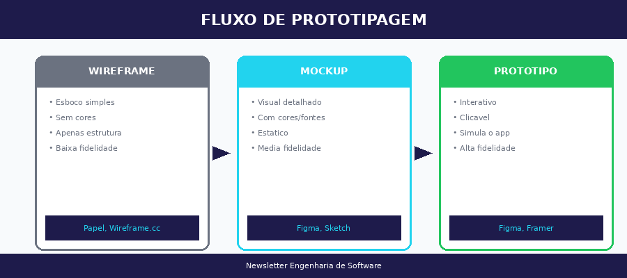

# Semana 03 — Sistemas Operacionais e UX Design

!!! abstract "Resumo da Semana"
    **Período:** Março de 2026  
    **Disciplinas:** Sistemas Operacionais + Ferramentas Web e UX

---

## 📚 Aulas da Semana

### 🖥️ Sistemas Operacionais
**Professor:** Rafael Descio, M.Sc.

- [Aula — História, Conceitos e Estruturas de SO](aula-sistemas-operacionais.md)

**Tópicos abordados:**

- O que é um Sistema Operacional
- SO como Máquina Estendida e Gerenciador de Recursos
- Evolução histórica (1940 até hoje)
- Arquiteturas de Kernel (Monolítico, Microkernel, Híbrido)
- System Calls e modos de execução

---

### 🎨 Ferramentas Web e UX
**Professor:** Dr. Claudinei Dias (Ney)

- [Aula — UX Design: Fundamentos e Ferramentas](aula-ux-design.md)

**Tópicos abordados:**

- Os 3 Pilares das Boas Experiências (Utilidade, Usabilidade, Desejabilidade)
- UX vs UI — diferenças e relação
- Wireframe → Mockup → Protótipo
- Heurísticas de Nielsen
- Ferramentas: Figma, Framer, Bootstrap, Material Design

---

## 🖼️ Diagramas da Semana

### Sistemas Operacionais

| Diagrama | Descrição |
|----------|-----------|
|  | Evolução dos Sistemas Operacionais |
|  | Máquina Estendida vs Gerenciador de Recursos |
|  | Comparativo de arquiteturas de Kernel |

### UX Design

| Diagrama | Descrição |
|----------|-----------|
|  | Os 3 pilares das boas experiências |
|  | Diferença entre UX e UI |
|  | Wireframe → Mockup → Protótipo |

---

## 💡 Destaques da Semana

!!! tip "Frase do Prof. Descio (SO)"
    "A decisão que você toma em alto nível deve ser coerente com o que acontece no baixo nível."

!!! tip "Princípio de UX"
    "O contexto é o rei." — Joshua Porter

!!! warning "Provável conteúdo de prova (UX)"
    Os **3 Pilares das Boas Experiências**: Utilidade → Usabilidade → Desejabilidade

---

## 🔗 Links Úteis

### Sistemas Operacionais
- [Livro: Sistemas Operacionais Modernos - Tanenbaum](https://www.amazon.com.br/Sistemas-operacionais-modernos-Andrew-Tanenbaum/dp/8543005671)
- [Vídeo: O que é SO - Diolinux](https://www.youtube.com/watch?v=B9VWL3gXBaI)

### UX Design
- [Figma](https://www.figma.com/)
- [Nielsen Norman Group](https://www.nngroup.com/)
- [Behance - Inspiração](https://www.behance.net/)
- [Material Design](https://m3.material.io/)

---

## ✅ Checklist de Estudos

- [ ] Ler aula de Sistemas Operacionais
- [ ] Responder as 4 perguntas de fixação (SO)
- [ ] Ler aula de UX Design
- [ ] Responder as 4 perguntas de fixação (UX)
- [ ] Explorar o Figma (criar conta gratuita)
- [ ] Revisar os diagramas
